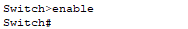
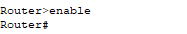
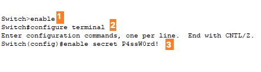
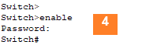

# This is a manual for basic configurations of routers and switches

## Main Modes in a Router and Switch (No Authentication)
There are two main modes in router and switch terminals. Namely **User EXEC** and **Privileged EXEC** mode.
- User EXEC (view only mode): Allows the user to execute a few monitoring commands. 
    - When a user is in this mode, it means they do not have the authority to execute high-level commands. 
    -  By default, the user does not have to enter a password to access this mode.
    - Entering User mode without authentication:
        -  

- Privileged EXEC (Enabled mode): Allows the user to execute all commands.
    - These commands can be for monitoring, configuration, and management of a device.
    - This should always be protected with a strong password. By default, there is no authentication.
    - To switch to privilege mode, use the command **enable**.
    - Entering Privileged mode without authentication:
        -  

## Main Modes in a Router and Switch (Authentication)
Setting up authentication on a router and switch. The process applies to both of them.
-  
    1. Switch to Privilege mode.
    2. **configure terminal** command allows you to be in a mode of making changes to device's settings. A message will be displayed revealing that you are in that mode.
    3. The third point shows how to set up an encrypted password to the device. **enable secret** is a command, then the last part is your password.
    4. Now, for the user to be in a Privilege mode they need to enter a password.
    5. **Tip**: To get out of any mode use the **exit** command

