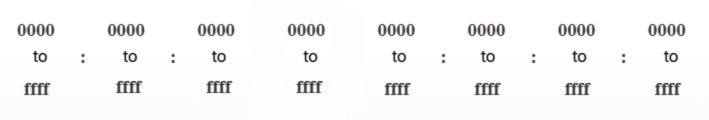

# About IPv6

## Why do we need IPv6
- The depletion of IPv4 is one of the main reasons why we need IPv6, which provides around 340 undecillion unique addresses.
- The introduction of IoT (Internet of Things) poses a serious threat on the depletion of IPv4 as devices i.e smart TVs, refrigerator can access the internet.
- Also, IPv6 is designed to address IPv4 limitations e.g  NAT issues which breaks end-to-end connectivity and creates latency on applications.

## When do we transition from IPv4 to IPv6
There's no date and time of the transition but the IETF created three techniques which network administrators can use to mitigate to IPv6:
    - **Dual Stack**: Allows devices to run both IPv4 and IPv6 protocols at the same time.
    - **Translation**: This allows an IPv6 packet to be translated to an IPv4 packet and vise versa.
    - **Tunneling**: Transports an IPv6 packet (encapsulated inside IPv4 packet) over IPv4 network.

## IPv6 Addressing Formats

IPv6 addresses have the length of 128 bits (**XXXX:XXXX:XXXX:XXXX:XXXX:XXXX:XXXX:XXXX**), and it is written in hexadecimal. IPv6 addresses are not case-sensitive, meaning the hexadecimal digits can be written either in uppercase or lowercase.   
There are ways/methods in which we can represent the IPv6 address:
- **2001:0db8:0000:00a3:abcd:0000:0000:1234**  
This is the **Full (Extended) Format**. A full written IPv6 address
- **2001:db8:0:a3:abcd:0:0:1234**  
**Omitting Leading Zeros**. With this method, we only omit/remove the leading zeros e.g, *0ab0 becomes ab0*. 
- **2001:db8:0:a3:abcd::1234**  
**Double Colon**. With this method, we compress any single string of one or more hextets consisting of zeros e.g ...0000:0000:...1234 => ...**::**...1234.   
This can only be applied once; we replace those zeros with (**::**).   
The best practice is to use the Double Colon to the longest string of zeros if they are equal, then apply it to the first string.

